# FDA Regulatory Assistant for SaMDs- Architecture Overview

## LangGraph Multi-Agent System Architecture

This document describes the current architecture of the FDA Regulatory Assistant for SaMDs, which implements a simplified multi-agent system using LangGraph for regulatory compliance analysis and gap assessment.

## System Overview

The FDA Regulatory Assistant is built on a **LangGraph agent workflow** that orchestrates multiple specialized agents to provide comprehensive regulatory compliance analysis. The system supports both **question-answering** and **document gap analysis** workflows with real-time streaming responses.

### Core Architecture Principles

1. **Simplified State Management**: Uses LangGraph's built-in constructs with TypedDict and message passing
2. **Agent Specialization**: Each agent focuses on a specific domain (cybersecurity, regulatory, auditing, reporting)
3. **Clean Communication**: Agents communicate through messages rather than complex state updates
4. **Tool Integration**: Comprehensive tools module for document processing and RAG integration
5. **Streaming Support**: Real-time response streaming with source references

## Agent and Tool Overview

### Multi-Agent System Architecture

| Agent | Primary Role | Tools Used | Key Responsibilities |
|-------|-------------|------------|---------------------|
| **Supervisor** | Workflow orchestration and final compilation | None (routing only) | • Routes tasks to appropriate specialists<br>• Compiles final responses as FDA auditor<br>• Handles workflow termination logic<br>• Provides authoritative FDA assessments |
| **Document Processor** | File processing and preparation | `chunk_document` | • Processes uploaded ZIP files and documents<br>• Extracts text content using PyMuPDF<br>• Creates document chunks for analysis<br>• Prepares documents for compliance review |
| **Cybersecurity Agent** | Cybersecurity compliance analysis | `retrieve_cybersecurity_information`<br>`analyze_document_compliance` | • Analyzes cybersecurity compliance requirements<br>• Focuses on FDA cybersecurity guidance and SOUP<br>• Reviews security vulnerabilities and threats<br>• Validates cybersecurity documentation |
| **Regulatory Agent** | FDA regulatory compliance review | `retrieve_regulatory_information`<br>`analyze_document_compliance` | • Reviews FDA regulatory requirements<br>• Handles 510K, PMA, and regulatory pathways<br>• Analyzes submission guidelines compliance<br>• Validates regulatory documentation |
| **Auditor Agent** | Gap analysis and compliance assessment | `perform_gap_analysis`<br>`identify_document_gaps` | • Performs comprehensive gap analysis<br>• Identifies compliance gaps and missing requirements<br>• Calculates compliance scores<br>• Assesses submission readiness |
| **Report Generator** | Comprehensive reporting | `generate_gap_analysis_report` | • Creates detailed compliance reports<br>• Generates executive summaries<br>• Provides actionable recommendations<br>• Formats final deliverables |

### Complete Tools Inventory

| Tool Category | Tool Name | Description | Used By |
|---------------|-----------|-------------|---------|
| **Document Processing** | `chunk_document` | Splits documents into manageable chunks | Document Processor |
| | `extract_document_metadata` | Extracts file metadata and properties | All agents |
| | `process_uploaded_documents` | Handles file uploads and processing | Document Processor |
| | `convert_uploaded_files_to_documents` | Converts files to LangChain Documents | Document Processor |
| **Compliance Analysis** | `analyze_document_compliance` | Analyzes documents for regulatory compliance | Cybersecurity, Regulatory |
| | `validate_submission_format` | Validates submission package format | Regulatory Agent |
| | `identify_document_gaps` | Identifies missing compliance requirements | Auditor Agent |
| | `perform_gap_analysis` | Comprehensive gap analysis | Auditor Agent |
| **Regulatory Tools** | `generate_compliance_checklist` | Creates regulation-specific checklists | All agents |
| | `extract_regulatory_requirements` | Extracts requirements from documents | Regulatory Agent |
| | `search_regulatory_database` | Searches regulatory guidance database | All agents |
| **RAG Integration** | `retrieve_cybersecurity_information` | Queries cybersecurity knowledge base | Cybersecurity Agent |
| | `retrieve_regulatory_information` | Queries regulatory knowledge base | Regulatory Agent |
| **Reporting** | `generate_gap_analysis_report` | Generates comprehensive compliance reports | Report Generator |
| | `compare_documents` | Compares documents for consistency | All agents |

## LangGraph Workflow Diagram

```mermaid
graph TD
    A[👤 User Input] --> B{🔀 Workflow Type}
    B -->|❓ Question Answering| C[🎯 Supervisor Agent]
    B -->|📁 Gap Analysis with Files| C[🎯 Supervisor Agent]

    C --> D{🧠 Routing Decision}

    D -->|📄 Files Present| E[📋 Document Processor]
    D -->|🔒 Cybersecurity Keywords| F[🛡️ Cybersecurity Agent]
    D -->|📜 Regulatory Keywords| G[⚖️ Regulatory Agent]
    D -->|🔍 Analysis Complete| H[🕵️ Auditor Agent]
    D -->|📊 Report Needed| I[📈 Report Generator]
    D -->|✅ FINISH| J[🏁 End]

    E --> K[📝 Process Files & Extract Content<br/>• ZIP extraction<br/>• Document chunking<br/>• Metadata extraction]
    E --> C

    F --> L[🔐 Query Cybersecurity RAG<br/>• SOUP analysis<br/>• Vulnerability assessment<br/>• Security compliance]
    F --> C

    G --> M[📋 Query Regulatory RAG<br/>• 510K requirements<br/>• PMA guidelines<br/>• Submission standards]
    G --> C

    H --> N[📊 Perform Gap Analysis<br/>• Compliance scoring<br/>• Gap identification<br/>• Readiness assessment]
    H --> C

    I --> O[📑 Generate Comprehensive Report<br/>• Executive summary<br/>• Detailed findings<br/>• Recommendations]
    I --> C

    C --> P[🎯 Compile Final FDA Assessment<br/>• Synthesize findings<br/>• Regulatory context<br/>• Professional recommendations]
    P --> Q[📡 Stream Response with Sources<br/>• Word-by-word streaming<br/>• Source references<br/>• Progress indicators]
    Q --> J

    %% Evaluation Components
    L --> R[📊 RAGAS Evaluation<br/>• LLM Context Recall<br/>• Faithfulness<br/>• Factual Correctness<br/>• Response Relevancy<br/>• Context Entity Recall<br/>• Noise Sensitivity]
    M --> S[📊 RAGAS Evaluation<br/>• LLM Context Recall<br/>• Faithfulness<br/>• Factual Correctness<br/>• Response Relevancy<br/>• Context Entity Recall<br/>• Noise Sensitivity]

    L --> T[🔬 LangSmith Evaluation<br/>• QA Evaluator<br/>• Contextual QA<br/>• Chain of Thought<br/>• Helpfulness Criteria]
    M --> U[🔬 LangSmith Evaluation<br/>• QA Evaluator<br/>• Contextual QA<br/>• Chain of Thought<br/>• Helpfulness Criteria]

    R --> V[📈 RAGAS Dashboard<br/>• Automated metrics<br/>• Performance tracking<br/>• Quality scores]
    S --> V

    T --> W[📊 LangSmith Dashboard<br/>• Trace analysis<br/>• Performance monitoring<br/>• Dataset management]
    U --> W

    %% Styling
    style A fill:#e3f2fd,stroke:#1976d2,stroke-width:3px
    style C fill:#fff3e0,stroke:#f57c00,stroke-width:3px
    style E fill:#f3e5f5,stroke:#7b1fa2,stroke-width:2px
    style F fill:#e8f5e8,stroke:#388e3c,stroke-width:2px
    style G fill:#fff8e1,stroke:#f9a825,stroke-width:2px
    style H fill:#fce4ec,stroke:#c2185b,stroke-width:2px
    style I fill:#e0f2f1,stroke:#00796b,stroke-width:2px
    style J fill:#ffebee,stroke:#d32f2f,stroke-width:3px
    style B fill:#f5f5f5,stroke:#616161,stroke-width:2px
    style D fill:#f5f5f5,stroke:#616161,stroke-width:2px

    %% Tool boxes styling
    style K fill:#f8f9fa,stroke:#6c757d,stroke-width:1px
    style L fill:#f8f9fa,stroke:#6c757d,stroke-width:1px
    style M fill:#f8f9fa,stroke:#6c757d,stroke-width:1px
    style N fill:#f8f9fa,stroke:#6c757d,stroke-width:1px
    style O fill:#f8f9fa,stroke:#6c757d,stroke-width:1px
    style P fill:#fff3e0,stroke:#f57c00,stroke-width:2px
    style Q fill:#e3f2fd,stroke:#1976d2,stroke-width:2px

    %% Evaluation styling
    style R fill:#fff3e0,stroke:#ff9800,stroke-width:2px
    style S fill:#fff3e0,stroke:#ff9800,stroke-width:2px
    style T fill:#e8eaf6,stroke:#3f51b5,stroke-width:2px
    style U fill:#e8eaf6,stroke:#3f51b5,stroke-width:2px
    style V fill:#fff3e0,stroke:#ff9800,stroke-width:3px
    style W fill:#e8eaf6,stroke:#3f51b5,stroke-width:3px
```



### Diagram Legend

| Component | Description | Color Code |
|-----------|-------------|------------|
| 👤 **User Input** | Entry point for questions or file uploads | Blue |
| 🎯 **Supervisor Agent** | Central orchestrator and FDA auditor | Orange |
| 📋 **Document Processor** | File processing and content extraction | Purple |
| 🛡️ **Cybersecurity Agent** | Security compliance analysis | Green |
| ⚖️ **Regulatory Agent** | FDA regulatory compliance review | Yellow |
| 🕵️ **Auditor Agent** | Gap analysis and compliance scoring | Pink |
| 📈 **Report Generator** | Comprehensive reporting and summaries | Teal |
| 📊 **RAGAS Evaluation** | Automated RAG evaluation metrics | Orange |
| 🔬 **LangSmith Evaluation** | LLM-based evaluation and tracing | Blue |
| 📈 **RAGAS Dashboard** | Performance tracking and quality scores | Orange |
| 📊 **LangSmith Dashboard** | Trace analysis and monitoring | Blue |
| 🏁 **End** | Workflow completion | Red |

## Key Components

### 1. LangGraph Workflow (`graph/`)

**Purpose**: Orchestrates multi-agent workflows for regulatory compliance analysis.

**Core Files**:
- `graph.py` - Main workflow orchestration and streaming logic
- `agents.py` - Agent implementations and tool bindings
- `state.py` - State management and helper functions

**Workflow Types**:
- **Question Answering**: Routes to appropriate specialist agent based on question type
- **Gap Analysis**: Sequential processing through document_processor → cybersecurity_agent → regulatory_agent → auditor_agent → report_generator

**State Structure**:
```python
class ComplianceGapState(TypedDict):
    # Core LangGraph state - messages automatically accumulate
    messages: Annotated[List[BaseMessage], operator.add]

    # Team and routing management
    team_members: List[str]
    next: str

    # Workflow context
    workflow_type: Literal["question_answering", "gap_analysis"]
    user_question: Optional[str]
    uploaded_files: List[Dict[str, Any]]

    # Document processing
    processed_documents: List[Document]

    # Final outputs
    final_response: Optional[str]
    response_sources: List[Dict[str, Any]]
```

### 2. Agent Implementation Details

**Supervisor Agent Routing Logic**:
- **Cybersecurity Keywords**: cybersecurity, cyber security, SOUP, vulnerability, security, threat, malware, encryption, penetration testing, authentication
- **Regulatory Keywords**: 510K, 510(k), PMA, premarket approval, regulatory, submission, FDA approval, compliance, guidance documents, QSR
- **Priority**: If question contains both cybersecurity AND regulatory keywords, routes to cybersecurity_agent
- **Termination**: Uses enhanced logic to prevent recursion loops and ensure proper workflow completion

**Agent Communication Pattern**:
- All agents communicate through LangGraph's message passing system
- Each agent returns to supervisor after completing their analysis
- Supervisor compiles final FDA auditor assessment with source references
- Word-by-word streaming provides real-time user feedback

### 3. Tools Module (`tools/`)

**Purpose**: Comprehensive toolkit for document processing, compliance analysis, and RAG integration.

**Complete Tool Inventory** (15 core tools):

**Document Processing Tools**:
- `chunk_document` - Split documents into manageable chunks with configurable size/overlap
- `extract_document_metadata` - Extract comprehensive file metadata and content statistics
- `process_uploaded_documents` - Handle file uploads with error handling and validation
- `convert_uploaded_files_to_documents` - Convert uploaded files to LangChain Document objects

**Compliance Analysis Tools**:
- `analyze_document_compliance` - Analyze documents against specific regulatory requirements (510K, PMA, QSR)
- `validate_submission_format` - Validate document format against FDA submission standards
- `identify_document_gaps` - Identify missing compliance requirements and documentation
- `perform_gap_analysis` - Comprehensive gap analysis with scoring and readiness assessment

**Regulatory Research Tools**:
- `generate_compliance_checklist` - Create regulation-specific checklists for different device classes
- `extract_regulatory_requirements` - Extract specific requirements from regulatory documents
- `search_regulatory_database` - Search regulatory guidance database (placeholder for future implementation)

**RAG Integration Tools**:
- `retrieve_cybersecurity_information` - Query pre-loaded cybersecurity knowledge base
- `retrieve_regulatory_information` - Query pre-loaded regulatory knowledge base

**Reporting Tools**:
- `generate_gap_analysis_report` - Generate comprehensive compliance reports with executive summaries
- `compare_documents` - Compare documents for consistency and completeness analysis

### 4. RAG Chain Manager (`ragchains/chain_manager.py`)

**Purpose**: Centralized management of RAG chain instances with performance optimization.

**Features**:
- **Singleton Pattern**: Single instance per chain type
- **Pre-warming**: Loads chains at startup for optimal performance
- **Thread-Safe**: Concurrent access support with asyncio locks
- **Dual Access**: Both async (Chainlit) and sync (tools) interfaces

**Chain Types**:
- **Cybersecurity RAG**: FDA cybersecurity guidance and SOUP documentation
- **Regulatory RAG**: FDA regulatory requirements and submission guidelines

### 5. Document Processing (`utils/document_parsers.py`)

**Purpose**: Advanced document parsing with support for multiple file formats.

**Supported Formats**:
- **PDF**: PyMuPDF (fitz) for high-quality text extraction
- **Word Documents**: python-docx for .docx and .doc files
- **Text Files**: Direct text processing
- **ZIP Archives**: Automatic extraction and processing of contained files

**Features**:
- Metadata extraction (page count, word count, file size)
- Error handling and graceful degradation
- Encoding detection for text files
- Structured output with success/error status

### 6. Streaming Configuration (`utils/streaming_config.py`)

**Purpose**: Advanced streaming configuration for optimal user experience.

**Current Configuration**:
- **Word-by-word streaming**: 50ms delay between words (configurable)
- **Formatting preservation**: Maintains numbered lists, line breaks, and text structure
- **Source reference streaming**: Dedicated formatting for source citations
- **Adaptive delays**: Different speeds for different content types

**Key Features**:
- Preserves text formatting during streaming
- Configurable word delay (WORD_DELAY = 0.05 seconds)
- Separate streaming for sources with faster display
- Maintains readability during real-time output

### 7. Evaluation Framework (`evals/`)

**Purpose**: Comprehensive evaluation system for RAG chain quality and performance monitoring.

**RAGAS Evaluation Components**:
- **Automated Metrics**: LLM Context Recall, Faithfulness, Factual Correctness, Response Relevancy, Context Entity Recall, Noise Sensitivity
- **Synthetic Data Generation**: Automated test dataset creation from FDA documents
- **Performance Tracking**: Quality scores and trend analysis
- **Dataset Upload**: Integration with RAGAS cloud platform for centralized monitoring

**LangSmith Evaluation Components**:
- **LLM-based Evaluators**: QA Evaluator, Contextual QA, Chain of Thought, Helpfulness Criteria
- **Trace Analysis**: Detailed execution tracing and performance monitoring
- **Dataset Management**: Centralized test dataset creation and management
- **Custom Criteria**: Configurable evaluation criteria for domain-specific requirements

**Evaluation Datasets**:
- **Cybersecurity RAG**: FDA cybersecurity guidance, SOUP documentation, vulnerability assessments
- **Regulatory RAG**: FDA regulatory requirements, 510K guidelines, PMA standards, QSR compliance

**Key Features**:
- **Dual Evaluation**: Both RAGAS and LangSmith for comprehensive assessment
- **Automated Testing**: Synthetic data generation from real FDA documents
- **Performance Monitoring**: Continuous evaluation and quality tracking
- **Domain-specific Metrics**: Tailored evaluation criteria for regulatory compliance

### 8. Chainlit Integration (`main.py`)

**Purpose**: Web-based chat interface with file upload support and streaming responses.

**Features**:
- **File Upload**: Support for individual files and ZIP archives up to 100MB
- **Real-time Streaming**: Word-by-word response streaming with source references
- **Error Handling**: Graceful error handling with user-friendly messages
- **Session Management**: Per-session workflow initialization with chain pre-warming
- **Progress Indicators**: Real-time agent status updates during processing

## Data Flow Architecture

### 1. Application Startup Flow
```
main.py → RegulatoryWorkflow() → Chain Manager → Pre-warm RAG Chains →
Initialize LangGraph Agents → Ready for User Requests
```

### 2. Question Answering Flow
```
User Question → Supervisor Agent → Keyword Analysis → Route to Specialist Agent →
Tool Execution → RAG Query → Agent Response → Supervisor Compilation →
Word-by-word Streaming → Source References → Complete
```

### 3. Gap Analysis Flow
```
ZIP Upload → Supervisor → Document Processor → File Extraction & Chunking →
Supervisor → Cybersecurity Agent → Security Analysis →
Supervisor → Regulatory Agent → Regulatory Analysis →
Supervisor → Auditor Agent → Gap Analysis & Scoring →
Supervisor → Report Generator → Comprehensive Report →
Supervisor → Final FDA Assessment → Streaming Response
```

### 4. Streaming Response Flow
```
Agent Message → Source Extraction → Progress Indicators →
Supervisor Final Response → Word-by-word Streaming →
Source References Streaming → Completion Status
```

### 5. LangGraph State Management Flow
```
Initial State Creation → Message Accumulation (operator.add) →
Agent Processing → State Updates → Supervisor Routing →
Next Agent Selection → Final State Compilation
```

### 6. Evaluation Flow
```
RAG Chain Response → RAGAS Metrics Calculation →
LangSmith Trace Analysis → Performance Scoring →
Quality Dashboard Updates → Continuous Monitoring
```

**RAGAS Evaluation Pipeline**:
```
FDA Documents → Synthetic Dataset Generation →
RAG Chain Testing → Automated Metrics →
Quality Scores → RAGAS Dashboard
```

**LangSmith Evaluation Pipeline**:
```
Test Questions → Chain Execution →
Trace Collection → LLM-based Evaluation →
Performance Analysis → LangSmith Dashboard
```

## Architecture Benefits

### 1. Performance Optimization
- **Pre-warmed Chains**: Instant response times after startup
- **Shared Vector Stores**: Memory-efficient document storage
- **Concurrent Processing**: Thread-safe multi-agent execution
- **Streaming Responses**: Real-time user feedback

### 2. Scalability & Maintainability
- **Modular Design**: Clear separation of concerns
- **Tool Composition**: Flexible agent capabilities
- **State Simplification**: Minimal state with message passing
- **Error Isolation**: Agent failures don't affect entire system

### 3. User Experience
- **Intelligent Routing**: Questions routed to appropriate specialists
- **Progress Feedback**: Real-time streaming with agent identification
- **Source References**: All responses include original source citations
- **File Processing**: Support for complex document packages

### 4. Developer Experience
- **Clean APIs**: Simple interfaces for extending functionality
- **Comprehensive Testing**: Isolated component testing
- **Documentation**: Extensive inline and external documentation
- **Tool Development**: Easy addition of new agent capabilities

## Usage Patterns

### 1. Starting the Application
```bash
# Install dependencies
uv sync

# Set environment variables
export OPENAI_API_KEY=your_api_key_here

# Start the Chainlit application with auto-reload
chainlit run main.py -w
```

### 2. Question Answering Workflow
```python
# Example: Cybersecurity question
user_input = "What are the FDA cybersecurity requirements for medical devices?"

# Workflow execution:
# 1. Supervisor analyzes keywords → routes to cybersecurity_agent
# 2. Cybersecurity agent uses retrieve_cybersecurity_information tool
# 3. Agent returns analysis with source references
# 4. Supervisor compiles final FDA auditor assessment
# 5. Response streams word-by-word with sources
```

### 3. Gap Analysis Workflow
```python
# Example: Upload ZIP file with regulatory documents
uploaded_files = [{"name": "submission_package.zip", "content": zip_data}]

# Sequential workflow execution:
# 1. Document processor: extracts files, creates chunks
# 2. Cybersecurity agent: analyzes security compliance
# 3. Regulatory agent: reviews regulatory requirements
# 4. Auditor agent: performs gap analysis with scoring
# 5. Report generator: creates comprehensive report
# 6. Supervisor: compiles final FDA assessment
```

### 4. Programmatic Usage
```python
from graph.graph import create_workflow

# Create workflow instance
workflow = create_workflow(prewarm_chains=True)

# Async usage with streaming
async for response_chunk in workflow.run_async(
    "What are SOUP requirements?",
    uploaded_files=None
):
    print(response_chunk, end="")

# Sync usage
result = workflow.run_sync("Analyze cybersecurity compliance")
```

### 5. Tool Development
```python
from langchain_core.tools import tool
from ragchains.chain_manager import get_chain_manager

@tool
def custom_regulatory_tool(question: str) -> Dict[str, Any]:
    """Custom tool that uses pre-loaded RAG chains."""
    chain_manager = get_chain_manager()
    return chain_manager.query_regulatory_chain_sync(question)
```

### 6. Agent Customization
```python
from graph.state import create_agent
from tools import retrieve_cybersecurity_information, analyze_document_compliance

# Create specialized agent with specific tools
tools = [retrieve_cybersecurity_information, analyze_document_compliance]
system_prompt = "You are a cybersecurity specialist for FDA medical devices..."
agent = create_agent(llm, tools, system_prompt)
```

### 7. Evaluation Workflows

**Running RAGAS Evaluation**:
```python
# Cybersecurity RAG evaluation
from evals.ragas_eval_for_cybersecurity_rag import create_ragas_dataset_and_evaluate
result = create_ragas_dataset_and_evaluate()
print(f"RAGAS Metrics: {result}")

# Regulatory RAG evaluation
from evals.ragas_eval_for_regulatory_rag import create_ragas_dataset_and_evaluate
result = create_ragas_dataset_and_evaluate()
```

**Running LangSmith Evaluation**:
```python
# Cybersecurity RAG evaluation
from evals.langsmith_eval_for_cybersecurity_rag import evaluate_cybersecurity_rag
result = evaluate_cybersecurity_rag("cybersecurity_dataset_id")

# Regulatory RAG evaluation
from evals.langsmith_eval_for_regulatory_rag import evaluate_regulatory_rag
result = evaluate_regulatory_rag("regulatory_dataset_id")
```

**Creating Evaluation Datasets**:
```python
# Generate synthetic datasets for RAGAS
from evals.sdg_cybersecurity_rag import create_langsmith_dataset
create_langsmith_dataset()  # Creates cybersecurity test dataset

from evals.sdg_regulatory_rag import create_langsmith_dataset
create_langsmith_dataset()  # Creates regulatory test dataset
```

## Configuration & Customization

### 1. Streaming Configuration
```python
# In utils/streaming_config.py
WORD_DELAY = 0.05  # 50ms delay between words (configurable)

# In graph/graph.py - stream_text_word_by_word function
async def stream_text_word_by_word(text: str, delay: float = WORD_DELAY):
    # Preserves formatting while streaming word-by-word
    # Separate delays for words vs whitespace/formatting
```

### 2. Agent Routing Rules
```python
# In graph/agents.py - Supervisor system prompt defines routing logic
CYBERSECURITY_KEYWORDS = [
    "cybersecurity", "cyber security", "cyber-security",
    "SOUP", "software of unknown provenance",
    "vulnerability", "CVE", "CWE", "security", "threat",
    "malware", "encryption", "penetration testing",
    "authentication", "authorization"
]

REGULATORY_KEYWORDS = [
    "510K", "510(k)", "predicate device",
    "PMA", "premarket approval", "regulatory",
    "submission", "FDA approval", "compliance",
    "guidance documents", "regulatory pathway",
    "QSR", "quality system regulation"
]
```

### 3. Tool Configuration
```python
# In tools/tools.py - Customizable parameters
DEFAULT_CHUNK_SIZE = 1000
DEFAULT_CHUNK_OVERLAP = 80

# Compliance analysis thresholds
COMPLIANCE_CRITERIA = {
    "510k": ["predicate device identification", "substantial equivalence", ...],
    "pma": ["clinical data", "manufacturing information", ...],
    "qsr": ["design controls", "document controls", ...]
}
```

### 4. Workflow Configuration
```python
# In graph/graph.py - RegulatoryWorkflow class
class RegulatoryWorkflow:
    def __init__(self, llm=None, prewarm_chains=True):
        self.llm = llm or ChatOpenAI(model="gpt-4.1-mini", temperature=0)
        # Recursion limit for LangGraph execution
        config = {"recursion_limit": 15}
```

## Development Guidelines

### 1. Adding New Agents
1. Define agent creation function in `graph/agents.py`
2. Specify tools list and system prompt
3. Use `create_agent()` helper function for consistency
4. Add agent to workflow graph in `graph/graph.py`
5. Update supervisor routing logic with new agent keywords
6. Add routing edge in workflow graph

### 2. Creating New Tools
1. Use `@tool` decorator for LangChain compatibility
2. Include comprehensive docstrings with parameters and return types
3. Return structured data (Dict[str, Any]) for consistency
4. Handle errors gracefully with try/catch blocks
5. Add to `tools/__init__.py` exports
6. Update agent tool lists as needed

### 3. Extending RAG Capabilities
1. Add new chain types to `ragchains/` directory
2. Update `chain_manager.py` with new chain methods
3. Create corresponding tools in `tools/tools.py`
4. Add sync/async access methods for tools
5. Update pre-warming logic in chain manager

### 4. Testing Strategy
```python
# Test individual tools
from tools import analyze_document_compliance
result = analyze_document_compliance.invoke({
    "document": test_doc,
    "regulation_type": "510k"
})

# Test workflow execution
from graph.graph import create_workflow
workflow = create_workflow(prewarm_chains=False)  # Skip for testing
result = workflow.run_sync("What are SOUP requirements?")

# Test streaming functionality
async for chunk in workflow.run_async("test question"):
    print(chunk, end="")

# Test agent routing
workflow = create_workflow()
# Cybersecurity routing test
cyber_result = workflow.run_sync("What are cybersecurity requirements?")
# Regulatory routing test
reg_result = workflow.run_sync("What documents are needed for 510K?")
```

## Performance Considerations

### 1. Memory Management
- RAG chains loaded once at startup via chain manager singleton
- Document processing uses chunking for large files (1000 char chunks, 80 char overlap)
- Vector stores shared across all agents through chain manager
- LangGraph state management with message accumulation using operator.add
- Automatic garbage collection for processed documents after workflow completion

### 2. Concurrency & Streaming
- Thread-safe chain manager with asyncio locks for concurrent access
- Word-by-word streaming with configurable delays (50ms default)
- Non-blocking streaming responses with progress indicators
- Session isolation through per-request workflow instances
- Enhanced recursion limit (15) with proper termination logic

### 3. Optimization Tips
- Pre-warm chains at application startup for instant response times
- Use appropriate chunk sizes based on document type and content
- Monitor token usage through OpenAI API for cost optimization
- Leverage chain manager caching for frequently accessed information
- Configure streaming delays based on user experience requirements

## Troubleshooting

### Common Issues
1. **Chain initialization errors**:
   - Check OpenAI API key configuration
   - Verify network connectivity and API access
   - Ensure chain manager pre-warming completes successfully

2. **File processing failures**:
   - Verify supported file formats (PDF, DOCX, TXT, ZIP)
   - Check file size limits (100MB max for uploads)
   - Validate ZIP file structure and contents

3. **Streaming interruptions**:
   - Check network stability and timeout settings
   - Verify word delay configuration in streaming_config.py
   - Monitor for GraphRecursionError and adjust recursion limits

4. **Agent routing issues**:
   - Verify supervisor keyword matching logic
   - Check agent tool availability and initialization
   - Ensure proper message passing between agents

### Debug Mode
```python
# Enable debug logging
import logging
logging.basicConfig(level=logging.DEBUG)

# Test chain manager initialization
from ragchains.chain_manager import get_chain_manager
chain_manager = get_chain_manager()
await chain_manager.prewarm_chains()

# Test workflow creation
from graph.graph import create_workflow
workflow = create_workflow(prewarm_chains=True)

# Test individual agent routing
result = workflow.run_sync("cybersecurity test question")
print(f"Routing result: {result}")
```

### Performance Monitoring
```python
# Monitor workflow execution time
import time
start_time = time.time()
result = workflow.run_sync("test question")
execution_time = time.time() - start_time
print(f"Workflow execution time: {execution_time:.2f} seconds")

# Monitor memory usage
import psutil
process = psutil.Process()
memory_usage = process.memory_info().rss / 1024 / 1024  # MB
print(f"Memory usage: {memory_usage:.2f} MB")
```

## Summary

This architecture provides a robust, scalable foundation for FDA regulatory compliance analysis with:

- **Clean separation of concerns** through specialized agents and tools
- **Comprehensive tooling** for document processing and compliance analysis
- **Optimal performance** through chain pre-warming and efficient state management
- **Real-time user experience** via word-by-word streaming with source references
- **Maintainable codebase** using LangGraph's built-in constructs and patterns
- **Extensible design** for adding new agents, tools, and capabilities

The simplified LangGraph implementation reduces complexity while maintaining full functionality, making it easier to develop, test, and maintain the regulatory compliance system.
